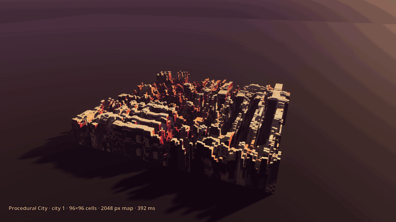
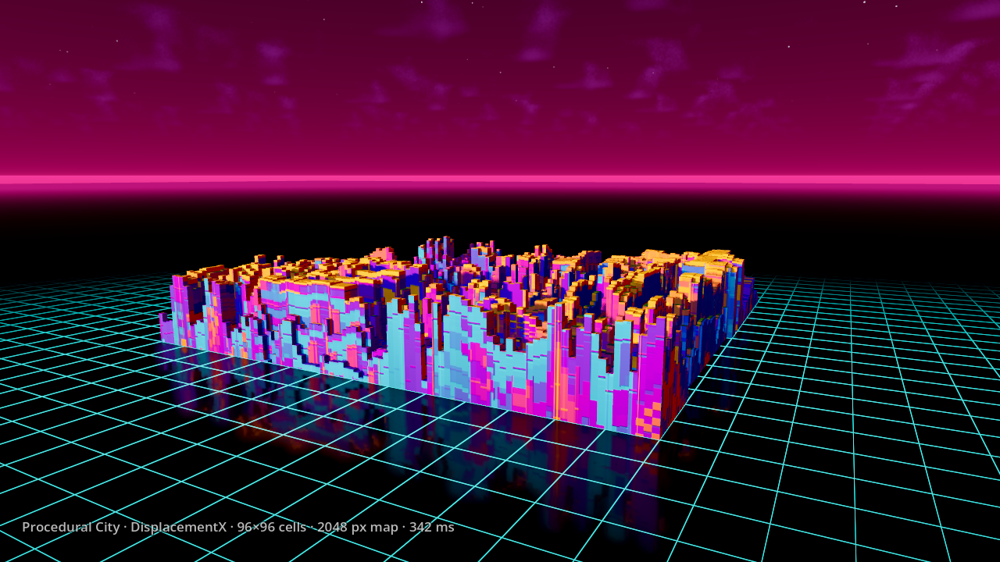
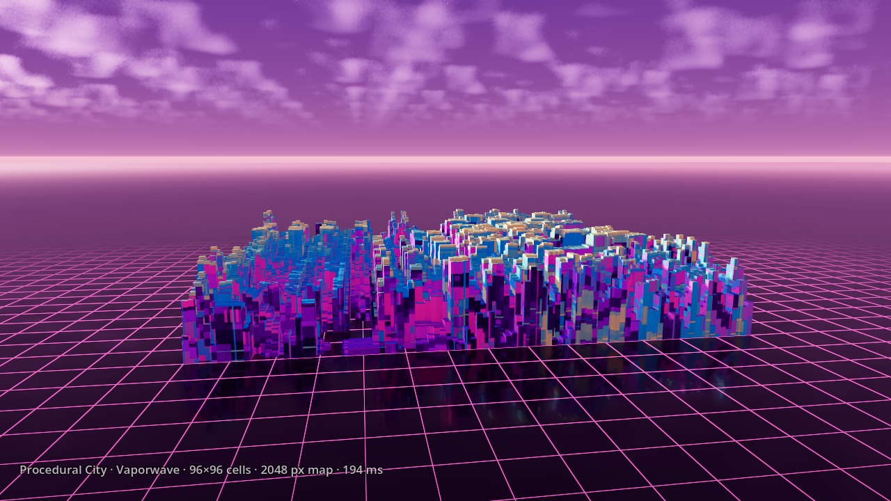
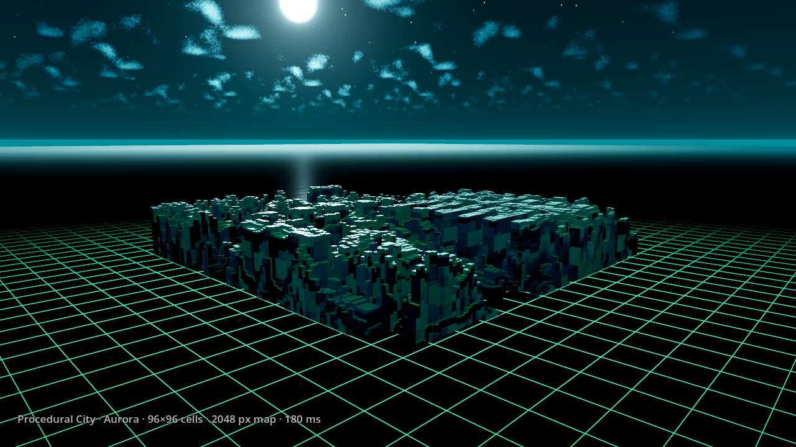
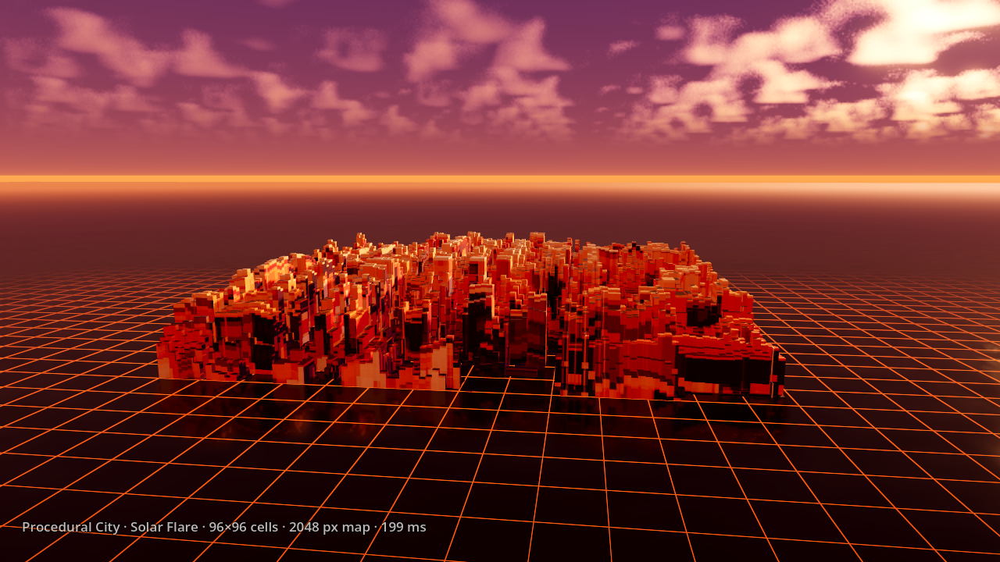

<h1 align="center">Procedural City</h1>

<p align="center">
  A Godot 4 GDExtension that turns a procedural displacement field into an
  extruded, textured, collidable city — in a few hundred milliseconds, in the
  editor or at runtime.
</p>

<p align="center">
  <a href="https://github.com/laiambryant/procedural-city/actions/workflows/ci.yml"></a>
  
  
  <a href="LICENSE"></a>
</p>

<p align="center">
  
</p>

<p align="center">
  <sub>96×96 blocks from a 2048 px field, generated in ~300 ms per city — recorded from <code>demo/scenes/main.tscn</code>.</sub>
</p>

<table align="center">
  <tr>
    <td></td>
    <td></td>
  </tr>
  <tr>
    <td></td>
    <td></td>
  </tr>
</table>

<p align="center">
  <sub>Same pipeline, four seeds and four palettes — DisplacementX (godisplacementx's default gradient), Vaporwave, Aurora and Solar Flare.</sub>
</p>

---

## What it does

Add a **ProcCityGenerator** node, press one button, and get:

- a **displacement field** rendered by a compute shader or on worker threads;
- **block geometry** extruded from it — one building per grid cell, with
  streets, baked ambient occlusion, per-cell tint variation and optional
  collision;
- an **albedo + normal material** generated from the same seed, so the maps
  line up with the geometry pixel for pixel.

Nothing is written to disk and no external process is involved: the default
backends are compiled into the extension, so runtime generation works in an
exported game.

## Install

Requires **Godot 4.4+**, **Python 3** with **SCons**, and a C++17 toolchain
(Visual Studio 2022 on Windows, `gcc`/`clang` elsewhere).

```bash
git clone --recurse-submodules https://github.com/laiambryant/procedural-city.git
cd procedural-city
pip install scons

scons platform=windows target=template_debug arch=x86_64     # editor
scons platform=windows target=template_release arch=x86_64   # export
```

Replace `platform=windows` with `linux` or `macos`. The first build compiles
godot-cpp and takes several minutes; later builds are incremental. Libraries
land in `demo/addons/procedural_city/bin/`, which the `.gdextension` file
already points at. Copy `demo/addons/procedural_city/` into your own project to
use it there.

Open `demo/` in Godot to drive the node from the inspector, or run the showcase
scene straight from the command line:

```bash
godot --path demo
```

The showcase generates four fixed seeds at startup, each with its own palette,
then orbits the cached cities on a 20 s loop, five seconds each. Blocks are meshed with no inset, so
neighbouring cells of the same height merge into a single roof instead of
standing apart as separate boxes, and the generator is sunk by
`clip_below_height` so the low ground stays under the water line and the
blocks rise out of it.
Rendering the animation is separate from the actual generation time; the
console reports generation timings.

The Forward+ showcase stands the city in still, reflective water with a faint
neon survey grid, under animated volumetric clouds adapted from The Beehive's
Level 0. Sky, fog, light and grid colours change with each city's palette.
Its resources are self-contained in `demo/environment/`; see the
[environment notes](demo/environment/README.md) for provenance and tuning.

Rebuild the README media with Godot and FFmpeg installed:

```bash
python3 scripts/record_showcase.py
# One full-resolution still for checking the composition:
python3 scripts/record_showcase.py --preview-time 2.7 --output /tmp/city.png
```

The recorder hosts the demo in a fixed 1280×720 SubViewport — a window manager
is free to resize the OS window, which would otherwise change the frame size —
then writes an 800 px GIF — one colour table per city, so each sky keeps its
gradients — and the four sample PNGs. The timeline is
a function of frame number, so slow rendering cannot change the camera path or
skip animation frames.

## Usage

### In the editor

Add a `ProcCityGenerator`, set **Mesh Size**, **Grid Vertices** and **Height
Scale**, then press **Generate All**. Everything the node produces is installed
under a single child called `GeneratedCity`, which you can keep, clear or
regenerate at will.

Every property documents itself: the class reference is compiled into the
binary, so hovering a field in the inspector shows what it does. Properties
that do not apply to the current configuration are greyed out.

### From GDScript

```gdscript
var city := ProcCityGenerator.new()
add_child(city)

city.mesh_size = Vector2(140, 140)
city.grid_vertices = Vector2i(97, 97)
city.height_scale = 26.0
city.height_power = 1.55      # > 1 thins the skyline into a few tall towers
city.block_inset = 0.11       # carves streets between freestanding blocks
city.generate_collision = true

city.params = GoplacementxParams.new()
city.params.resolution = 2048
city.params.randomize_seed = true

city.all_finished.connect(func(): print("city ready"))
city.generate_all()
```

You can skip field generation entirely and extrude any grayscale image:

```gdscript
city.set_height_image(my_heightmap)
city.build_geometry()
```

### Signals

| Signal | Arguments |
|---|---|
| `generation_started` | `stage: String` |
| `generation_progress` | `stage: String`, `ratio: float` |
| `generation_finished` | `stage: String`, `path: String` |
| `generation_failed` | `stage: String`, `message: String` |
| `all_finished` | — |

### Gameplay queries

Three queries read the cached cell heights, so they cost a grid lookup instead
of an image sample and keep working after `release_source_images()`:

```gdscript
var top := city.sample_city_height(point)        # height field value, 0 outside
var solid := city.is_point_inside_block(point)   # honours streets and clipping
var spawn := city.find_clear_point(point, 40.0)  # nearest cell clear of buildings
```

## Backends

**Generation Mode** picks how the displacement field is rendered:

| Mode | Engine | Works in an exported game |
|---|---|---|
| **GPU** (default) | [cppdisplacementx](https://github.com/laiambryant/cppdisplacementx) compute shader on a local `RenderingDevice` | yes |
| **CPU** | cppdisplacementx on worker threads, SSE2 fast paths | yes |
| **GPU (Legacy)** | the standalone [gpudisplacementx](https://github.com/laiambryant/gpudisplacementx) CLI | no |
| **CPU (Legacy)** | the standalone [godisplacementx](https://github.com/laiambryant/godisplacementx) CLI | no |

The two native modes are byte-identical to each other for a given seed, and GPU
falls back to CPU on renderers without a `RenderingDevice`.
`get_last_generation_mode_used()` reports which one actually ran. The legacy
modes shell out to the standalone CLIs — downloaded on demand and cached under
`user://` — and exist to reproduce output made before the native backends; they
cannot run from inside a PCK.

**Build Mode** picks how the field becomes geometry:

| Mode | Output | Notes |
|---|---|---|
| **ArrayMesh** (default) | one indexed mesh | continuous material across the whole city; the only backend with chunking, occluders and height clipping |
| **MultiMesh** | one GPU-instanced box per cell | material tiles per box |
| **CSG** | real `CSGBox3D`s | boolean-welded solid; expensive past ~2048 boxes |
| **HexHive** | warped hex-prism honeycomb | alley floors, rim boost, per-cell jitter |
| **GridMap** | a real `GridMap` + `MeshLibrary` | hand-editable after generation; supply your own library to stamp props |

## Performance

The pipeline is built for large grids: meshers write exact-size packed arrays
with analytic tangents, per-cell work is row-banded across threads (identical
output for any thread count), and intermediates skip the PNG round-trip. The
native CPU compositor runs the complete command stream per worker band,
avoiding thread creation for every drawing command. Chunk surfaces are filled
in parallel and committed in order. Actual timings depend on the backend,
material size and hardware; reproducible measurements and the remaining
simplification opportunities are in [docs/PERFORMANCE.md](docs/PERFORMANCE.md).

For very large cities, `geometry_chunks` splits the ArrayMesh into tiles the
renderer can cull independently, `generate_occluders` adds per-tile occluders,
and `clip_below_height` drops geometry buried under an opaque plane before it
is ever allocated.

## Carving a layout

A game that plans its own streets can hand them to the generator:
`carve_rects` takes mesh-local XZ rectangles (origin at the mesh centre) and
flattens them in the displacement field as it is produced. Geometry,
collision, `get_cell_heights()` and the clear-point queries all read the carved
field, so avenues, plazas and arenas stay open ground while the blocks between
them keep the procedural skyline. Contract: `demo/tests/carve_rects_contract.gd`.

```gdscript
gen.carve_rects = [Rect2(-200, -6, 400, 12), Rect2(-30, -30, 40, 40)]
gen.generate_all()
```

## Persisting a city

With **Persist In Scene** on, a city generated in the editor is owned by the
edited scene and saved with it. Its meshes, shapes and material go to
**External Resource Dir** (`res://generated_city` by default) as binary `.res`
files; the scene only stores references. Leave that path set — embedded in
scene text, a 96×96 city costs several megabytes of base64 on every save and
load. `externalize_generated_resources()` does the same for a city generated at
runtime.

## Repository layout

```
src/
  core/       ProcCityGenerator node, pipeline, worker threading, persistence
  meshing/    image → geometry backends and shared mesh infrastructure
  native/     in-process backends: params bridge, RenderingDevice compositor
  cli/        legacy CLI runner, params serialization, binary download, gRPC
  material/   material assembly from the generated maps
  editor/     inspector plugin
  hive/       standalone HiveGenCore floor planner
doc_classes/  class reference, compiled into the binary
demo/         runnable Godot project, showcase scene and headless tests
docs/         architecture notes
```

Internals, threading and determinism contracts:
[docs/ARCHITECTURE.md](docs/ARCHITECTURE.md). Setup, style and PR rules:
[CONTRIBUTING.md](CONTRIBUTING.md).

## Tests

Headless scripts under `demo/tests/` pin the contracts that matter:

```bash
godot --headless --path demo --script tests/mesher_contract.gd   # meshers, collision, queries
godot --headless --path demo --script tests/inspector_rules.gd    # which properties the editor greys out
godot --headless --path demo --script tests/chunked_geometry.gd  # chunking + gameplay queries
godot --headless --path demo --script tests/multimesh_parity.gd  # MultiMesh buffer layout
godot --headless --path demo --script tests/hive_parity.gd       # HiveGenCore RNG stream
godot --headless --path demo --script tests/scene_size.gd        # persisted scenes stay small
```

`bench_*.gd` scripts in the same folder time the pipeline and the mesher
backends.

## Credits

The displacement-field generator this pipeline builds on traces back to
[satelllte/displacementx](https://github.com/satelllte/displacementx); the
native and legacy CLI backends listed above are this project's own
reimplementations of that lineage.

## License

[GPL-3.0](LICENSE).

## Publishing

See the [Asset Store release guide](docs/RELEASING.md) for packaging, the current
submission steps, suggested listing copy and the remaining platform/license
metadata checks. The source archive alone does not contain installable binaries.
